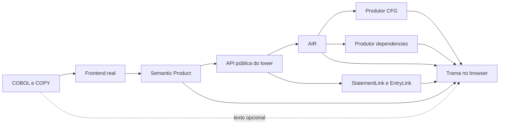

# Arquitetura e correlações

## Fronteiras

Aplicação React + TypeScript servida estaticamente por Vite. React Flow cuida de zoom, viewport, minimapa e seleção; ELK calcula apenas a geometria, em Web Worker. A geometria não muda o modelo de controle.

- `src/artifacts.ts`: reconhecimento por contrato, descompressão, rejeição de versões/publicações incompatíveis e SHA-256 do sidecar.
- `src/model.ts`: índices de identidades, joins explícitos, projeção de apresentação e consultas sobre arestas publicadas.
- `src/Graph.tsx`: geometria ELK, cancelamento de layouts antigos, renderização do viewport e seleção. Os nós não são editáveis.
- `src/Inspector.tsx`: fatos de COBOL, candidatos/suportes, fonte, limites e detalhes brutos carregados visualmente sob demanda.
- `bridge/ExportLinks.java`: adapter externo ao analisador; usa `FileLowering`, `CobolLowerer`, `AirFileOutput` e o `LoweringResult` retornado pela mesma API de produção.

Documentos brutos permanecem disponíveis. O visualizador não implementa um parser COBOL, lowerer, validator AIR, solver de valores ou novo CFG.

## Join exato

1. `CFG.publication.localId == AIR.publication.id.localId == dependencies.publication.localId`.
2. `CFG.SEQUENCE.label` → `AIR.Unit.sequences[].label`.
3. O terminador do nó deve coincidir, por OperationId completo e kind, com o terminador AIR dessa sequence.
4. `links.statements[].target` → OperationId; `source` → `{unit: UnitKey, handle: StatementId}` no SP. O adapter também fornece label e origin. O viewer verifica a presença da operação nessa sequence.
5. `links.entries[].target` → EntryId completo; a identidade fonte conserva compilationUnitId, structuralPath e canonicalProgramName.
6. `dependencies.sites` → EntryId + OperationId; `sequence` identifica o trecho publicado. Candidatos conservam `supports`, `producer`, `origin`, `premises` e remainders originais.
7. `dependencies.programs[].sourceOccurrence` pode agregar evidência fonte a uma ocorrência já correlacionada. Autoridades diferentes e candidatos condicionais não são misturados com a consulta executável.
8. O DAG de origins é percorrido por OriginId; artefatos por ArtifactId. Spans servem apenas para extrair o texto explicitamente fornecido.

A chave de uma identidade conserva domínio, publicação, unit, localId e owner quando presente. O domínio dos IDs CFG/AIR no wire CFG é definido pelo campo tipado, conforme o contrato. Objetos são comparados por conteúdo canônico, não pela ordem das chaves. Não há decodificação de hashes, interpretação de `sourceKey`, basename heurístico ou reconciliação por linha/texto.

O sidecar possui contrato próprio `cobol-explorer-links/1.0.0`, `spSha256`, `airSha256`, PublicationId, listas `statements` / `entries`, `loweringStatus` e limitações retornadas pelo lower. Os hashes correspondem aos arquivos originais, não a JSON reserializado. Hashes correlacionam documentos; não são assinatura do produtor.

## Apresentação COBOL

Cada nó continua representando um nó CFG. Statements ligados às operações dão texto e tipo ao cartão. Statements sem arquivo fonte usam a variante tipada do SP. Helpers sem link preservam sua identidade e provenance AIR.

Paragraphs/sections vêm de `controlTopology.regions`. A associação sobe a cadeia `occurrence.region → parent` até a região tipada mais próxima. A primeira linha do span da prova da região serve de título visual; ela não determina arestas ou membros. Nós com múltiplos statements preservam todos no inspetor. Um mesmo statement expandido em várias ocorrências CFG conserva os contextos separados.

Rótulos “Sim” / “Não” representam `BRANCH_TRUE` / `BRANCH_FALSE`. Alternativas com o mesmo destino continuam como arestas diferentes. Candidatos de chamada nunca viram arestas de controle para callees.

## Consulta de caminhos

Para uma EntryId escolhida:

1. Selecione exclusivamente transições com `activationEntry` igual a essa identidade.
2. Calcule `F`, os nós alcançáveis a partir do nó ENTRY, por BFS.
3. Calcule `R`, os nós que alcançam o(s) alvo(s), por BFS nas arestas invertidas.
4. O recorte é `F ∩ R`, com as arestas originais cujas pontas pertencem à interseção.
5. Uma segunda BFS registra predecessores para um caminho mínimo, sem enumerar caminhos exponencialmente numerosos.

Custo O(V+E) e memória O(V+E). Ciclos terminam por conjuntos de visitados. Os caminhos incluem as possibilidades estruturais publicadas, inclusive voltas em ciclos. Um caminho mínimo não resolve predicados. Não ter caminho conhecido é diferente de provar impossibilidade no COBOL completo.

A seleção usada como alvo permanece fixa enquanto o usuário inspeciona outros nós do recorte. As ações de navegação podem voltar à visão completa quando o destino está fora do recorte.

## Escala e segurança local

- Layout fora da thread principal e workers encerrados quando o recorte muda.
- Renderização limitada ao viewport. Busca e consultas não dependem da presença de um nó no DOM.
- JSON interno é formatado somente quando seu painel é aberto.
- Importação é atômica para a sessão: erro preserva o programa anterior. Resultados assíncronos de uma importação anterior não substituem uma seleção mais recente.
- Fontes e textos importados são renderizados como texto React, nunca HTML executável.
- Nenhum path/URL de provenance é aberto. Nomes lógicos não dão acesso ao filesystem nem à rede.
- Limites de bytes são operacionais, com rejeição explícita e sem descarte de fatos.

## Referências consultadas

Contratos e implementações locais fixados nos SHAs de `VALIDATION.md`:

- `proleap-poc/docs/domain/cobol-semantic-product.md`
- `cobol-lower/.../application/LoweringResult.java`, `SourceOrigins.java`, `CompilationLowerer.java`
- `analysis-ir/bindings/json-v1.md`
- `analysis-cfg/docs/architecture/cfg-json-v1.md`, `cfg-json-v2.md`, `cfg-json-v3.md`
- `analysis-cfg/docs/architecture/analysis-dependency-result-v1.md`
- `analysis-cfg/.../CfgJsonWriter.java`

Integração visual conforme a documentação oficial de [desempenho do React Flow](https://reactflow.dev/learn/advanced-use/performance) e [layout com ELK](https://reactflow.dev/examples/layout/elkjs).
